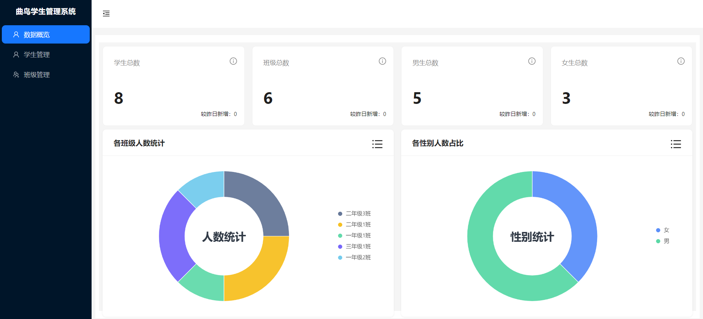

# 项目说明

这是一个用 IDE [Cloud Studio](https://www.cloudstudio.net/?utm=csdn) 快速搭建，并开发还原一个Web端的React版本的学生管理系统，使用local做数据存储，无后端交互。包含的功能为班级管理、学生管理、学生及班级信息统计的功能,效果如下（默认登录账号：quniao 密码为：123456）：

## 相关技术栈

React + antd + ant-design/charts

## 项目运行
1. yarn
2. yarn start

## 特别说明
本项目来源于《腾讯云Cloud Studio 实战训练营》的参赛作品，该作品在腾讯云Cloud Studio 中运行无误。